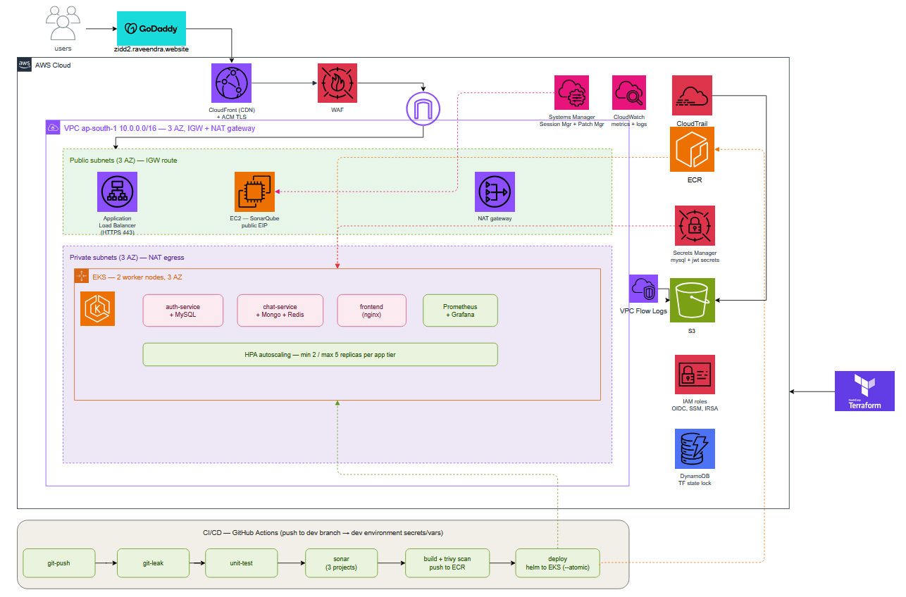

# ZIDD 2.0 — Cloud-Native DevSecOps Platform on AWS EKS

A production-shaped deployment of a real-time microservices chat application, built end to end with Infrastructure as Code, a full CI/CD pipeline with integrated security scanning, monitoring, and edge protection. Everything below is live and reproducible from Terraform + Helm + GitHub Actions.

**Live application:** `https://zidd2.raveendra.website`

---

## 1. What this project demonstrates

This is a complete DevSecOps lifecycle for a containerized microservices application:

- **Infrastructure as Code** — the entire AWS estate (network, compute, edge, security, identity) is defined in Terraform with remote state and locking.
- **Container orchestration** — the app runs on Amazon EKS with high availability, horizontal autoscaling, and self-healing deploys.
- **CI/CD with security built in** — a GitHub Actions pipeline runs secret scanning, unit tests, code-quality analysis (SonarQube), container image vulnerability scanning (Trivy), and deploys to the cluster via Helm.
- **Edge security** — CloudFront with a WAF (managed rule groups plus per-IP rate limiting), TLS via ACM, and an origin locked to CloudFront only.
- **Observability** — Prometheus and Grafana in-cluster, CloudWatch, VPC flow logs, and CloudTrail audit logging.
- **Least-privilege identity** — IAM roles for service accounts (IRSA), GitHub OIDC federation (no long-lived cloud keys), and SSM-based instance access (no SSH keys).

---

## 2. Application overview

ZIDD 2.0 is a real-time chat platform composed of three services plus their datastores.

| Service | Stack | Port | Datastore | Notes |
|---|---|---|---|---|
| **auth-service** | Spring Boot 3.2 / Java 17 | 8005 | MySQL | Signup, login, JWT issuance, user validation |
| **chat-service** | Spring Boot 3.2 / Java 17 | 8010 | MongoDB + Redis | Messages, WebSocket/STOMP real-time chat |
| **chat-app-client** | React / Vite, served by nginx | 80 | — | Domain-agnostic SPA; derives API URL from the browser location |

Each service ships as a container image in Amazon ECR and is deployed to EKS by Helm.

---

## 3. Architecture



The request path and platform layout, top to bottom:

**Edge:** User → GoDaddy DNS (`zidd2.raveendra.website`) → CloudFront (CDN + ACM TLS) → WAF (managed rules + rate limit) → Application Load Balancer.

**Network (VPC `10.0.0.0/16`, ap-south-1, 3 AZ):**
- **Public subnets** — ALB, SonarQube EC2 (Elastic IP), NAT gateway. Systems Manager provides access and patching.
- **Private subnets** — the EKS worker nodes (2× t3.medium) running all application workloads and monitoring; NAT gateway for egress.

**Workloads (EKS):** auth-service (+MySQL), chat-service (+MongoDB, +Redis), frontend (nginx), and the Prometheus + Grafana stack. HPA autoscales the app tiers (min 2 / max 5 replicas).

**Supporting services:** ECR (3 image repos), Secrets Manager, S3 (VPC flow logs, CloudFront logs, Terraform state), IAM (OIDC / SSM / IRSA roles), DynamoDB (Terraform state lock), CloudTrail (multi-region audit trail), CloudWatch (metrics + logs).

**Delivery:** GitHub Actions pipeline, triggered on push to the `dev` branch, using the `dev` GitHub Environment's secrets and variables.

> The editable architecture diagram (draw.io, with official AWS icons) is included as `zidd2-architecture.drawio`. Open it at app.diagrams.net.

---

## 4. Infrastructure (Terraform)

The Terraform is modular, with a flat root that wires the modules together.

**Modules:** `vpc` (3 public + 3 private subnets, IGW, single NAT, flow logs to S3), `s3`, `ec2` (generic; supports SSM Session Manager + Patch Manager via instance profile), `ecr`, `iam` (GitHub OIDC provider + CI role, least-privilege), `acm`, `alb`, `cloudfront` (+ WAF web ACL), `eks`, `secrets-manager`. Root files add the AWS Load Balancer Controller, External Secrets wiring, CloudTrail, and the EKS access entry for the CI role.

**State management:** S3 backend (`zidd2-tfstate-…`) with DynamoDB state locking.

**Key design decisions:**
- **EKS access via API access entries** — the cluster uses `API_AND_CONFIG_MAP` authentication mode so the GitHub CI role is granted cluster access through an access entry (rather than editing `aws-auth`). `bootstrap_cluster_creator_admin_permissions` is pinned to avoid cluster replacement on updates.
- **Single NAT gateway** — cost-conscious choice for a non-production footprint.
- **CloudFront-only ALB** — the ALB security group ingress is restricted to the CloudFront managed prefix list, so the origin is not reachable directly from the internet.

**Reproduce:**
```bash
cd terraform
terraform init
terraform plan -out=tfplan
terraform apply tfplan
```

---

## 5. Application deployment (Helm)

A single Helm chart deploys the whole application stack.

**Templates:** `storageclass` (gp3 via EBS CSI), `secrets`, `mysql`, `mongodb`, `redis`, `auth`, `chat`, `frontend`, `targetgroupbinding` (binds the frontend service to the ALB target group), and `hpa`.

**High availability:** each application tier runs 2 replicas; the HPA scales them between 2 and 5 based on CPU. Databases run as StatefulSets with gp3-backed persistent volumes.

**Secrets:** the chart reads database and JWT secrets from values that the CI pipeline injects at deploy time (`--set`), so no secrets live in the chart or the repo. (An External Secrets Operator integration with AWS Secrets Manager was also built and demonstrated — see section 9.)

**Deploy:**
```bash
helm upgrade --install zidd2 ./helm -n zidd2 --create-namespace \
  --set ecrRegistry=<account>.dkr.ecr.ap-south-1.amazonaws.com \
  --set imageTag=<tag> \
  --set mysql.rootPassword=<secret> \
  --set auth.jwtSecret=<secret> \
  --atomic --wait --timeout 5m
```

`--atomic` makes deploys **self-healing**: if the new pods fail their readiness probes within the timeout, Helm automatically rolls back to the last working release.

---

## 6. CI/CD pipeline (GitHub Actions)

Triggered on push to `dev` (and manually via workflow dispatch). The pipeline is environment-aware: the branch selects the GitHub Environment, whose secrets and variables are injected into the jobs. This makes it straightforward to extend to `stage` and `prod` (each as its own environment, optionally with a required-reviewer approval gate to make production a Continuous **Delivery** flow).

**Stages, in order:**

1. **setup** — resolves the target environment from the branch.
2. **git-leak** — [gitleaks](https://github.com/gitleaks/gitleaks-action) scans the repository for committed secrets. Fails fast.
3. **unit-test** — builds and packages both Java services with Maven.
4. **sonar** — SonarQube analysis of three projects: `auth-service`, `chat-service` (via Maven), and the React `frontend` (via the standalone SonarScanner). Results appear on the SonarQube server.
5. **build-push** — builds all three Docker images, scans each with **Trivy** for CRITICAL/HIGH vulnerabilities (results uploaded as SARIF to the GitHub **Security → Code scanning** tab), and pushes to ECR. Images are tagged with the commit SHA.
6. **deploy** — configures kubeconfig, runs `helm upgrade --install … --atomic`, and verifies the rollout.

**Authentication:** AWS access uses **GitHub OIDC** — the workflow assumes an IAM role via web identity federation, so there are no long-lived AWS keys stored in GitHub.

---

## 7. Security

Defense in depth across the stack:

- **Edge:** WAF web ACL on CloudFront with AWS managed rule groups (Common Rule Set, Known Bad Inputs) plus a **rate-based rule at 100 requests / 5-minute window per IP** (≈20 req/min per source IP — the tightest AWS WAF allows).
- **Network:** ALB origin restricted to the CloudFront managed prefix list; workloads in private subnets; egress via NAT.
- **Transport:** TLS terminated at CloudFront via an ACM certificate; viewer protocol policy redirects HTTP to HTTPS.
- **Identity:** IRSA for pod-level AWS permissions; GitHub OIDC for CI (no static keys); SSM Session Manager for instance access (no SSH keys or open port 22); SSM Patch Manager for OS patching.
- **Supply chain:** gitleaks (secret scanning), SonarQube (code quality/security), Trivy (image CVE scanning) — all gating the pipeline before deploy.
- **Audit & logging:** CloudTrail (multi-region, log-file validation) for API audit; VPC flow logs and CloudFront logs to S3; CloudWatch metrics and logs.

---

## 8. Observability

- **In-cluster:** Prometheus scrapes cluster and workload metrics; Grafana provides dashboards. Deployed via the `kube-prometheus-stack` Helm chart in the `monitoring` namespace.
- **Access:** Grafana is kept internal (`ClusterIP`) and reached via `kubectl port-forward` — least-exposure practice for an admin dashboard rather than putting it on the public internet.
  ```bash
  kubectl port-forward -n monitoring svc/monitoring-grafana 8080:80
  # open http://localhost:8080
  ```
- **AWS-native:** CloudWatch for infrastructure metrics/logs; CloudTrail for the API audit trail.

**Autoscaling demonstrated:** under synthetic load the HPA scaled the app tier from 2 to 3 replicas as CPU crossed the target, then scaled back in after the load subsided.

---

## 9. Notable engineering decisions & lessons

A few things that were solved along the way and are worth calling out:

- **GitHub immutable subject claims (OIDC).** Repositories created/renamed after mid-2026 use *immutable* OIDC subject claims that embed numeric org/repo IDs (`repo:<org>@<orgid>/<repo>@<repoid>:*`). The IAM trust policy had to match this exact format, which was the root cause of an initial `AssumeRoleWithWebIdentity` denial.
- **EKS cluster replacement guard.** Adding an `access_config` block without pinning `bootstrap_cluster_creator_admin_permissions` caused Terraform to plan a full cluster **replacement**. Pinning it kept the change an in-place update — a good example of always reading the plan before applying.
- **External Secrets Operator.** ESO was integrated with AWS Secrets Manager via IRSA and confirmed syncing (`SecretSynced`). Because of CRD/version churn on repeated Helm upgrades, the app was kept on Helm-injected Kubernetes secrets for demo stability, with the ESO integration documented and reproducible (install CRDs out-of-band, run the operator with CRD management disabled, and never `helm upgrade` the release).
- **Selective, tool-appropriate scanning.** Java services are scanned through the Maven Sonar plugin; the React frontend is scanned with the standalone SonarScanner — Maven can't analyze JS. A subtle gotcha: the frontend `sonar-project.properties` must be written without a UTF-8 BOM or the scanner fails to read `sonar.projectKey`.
- **Continuous Deployment today, Delivery-ready.** `dev` auto-deploys on push (Continuous Deployment). Adding a required reviewer to a `prod` environment turns production into a gated Continuous Delivery flow without any pipeline rewrite.

---

## 10. Repository layout

```
zidd2-devops-platform/
├── .github/workflows/ci-cd.yml     # the CI/CD pipeline
├── terraform/                      # all infrastructure as code
│   ├── main.tf, variables.tf, outputs.tf, versions.tf
│   ├── cloudtrail.tf, external-secrets.tf, lb-controller.tf
│   └── modules/                    # vpc, s3, ec2, ecr, iam, acm, alb, cloudfront, eks, secrets-manager
├── helm/                           # the application Helm chart
│   ├── Chart.yaml, values.yaml
│   └── templates/
├── auth-service/                   # Spring Boot auth service
├── chat-service/                   # Spring Boot chat service
├── chat-app-client/                # React frontend
└── docker-compose.yml              # local development
```

Secrets and state are excluded from version control (`.gitignore` covers `*.tfstate`, `terraform.tfvars`, `*.pem`, `.terraform/`, local DB data, and monitoring/ESO manifests).

---

## 11. Possible next enhancements

- **GitOps with ArgoCD** — replace the pipeline's push-based deploy with a pull-based, declarative model (drift detection, sync UI, easy rollback).
- **Multi-environment** — stand up `stage` and `prod` (the pipeline is already environment-aware) with a production approval gate.
- **CloudFront caching** — add a cache behavior for immutable static assets (`/assets/*`) while keeping API and WebSocket paths uncached.
- **Full HTTPS to the origin** — terminate TLS at the ALB as well as CloudFront.

---

*Built on Terraform, Helm, Amazon EKS, GitHub Actions, SonarQube, Trivy, Prometheus & Grafana. Region: ap-south-1 (Mumbai).*
